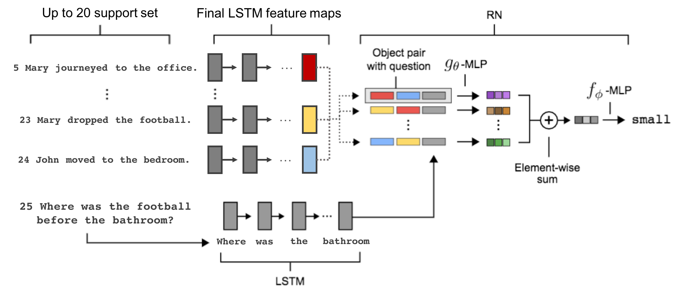

# A simple neural network module for relational reasoning

paper link: https://arxiv.org/abs/1706.01427

## Tensorflow implementation of Relation Network on bAbI dataset



1. **Load data**

```
python3 preprocessing.py --path='path-where-tasks_1-20_v1-2-located'
```